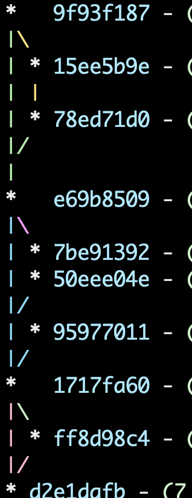

# "Enforce Rebase" Github Action

This action enforces clean, "single-bump" git history that looks like this:



It will fail any pushed PR branches if:

1. A PR branch contains any merge commits.  

   Specifically, this rule prevents developers from merging master _into_ 
   their branch as a way of making it up-to-date.  This creates
   [foxtrot commits](https://blog.developer.atlassian.com/stop-foxtrots-now/)
   and unsightly git log graphs.

   This also makes it illegal to update your branch using the Github UI's
   "Update Branch" button, which cannot be disabled and is a tempting 
   way to merge master into your branch.
2. The branch is not sitting on top of master.

   That is, it requires developers to rebase their work on the up-to-date 
   master branch before merging.

## Example use

Here's an example `action.yml` file.  Note that you must explicitly include
the `actions/checkout@v2` step as well as the `enforce-rebase@v2` step:

```yaml
name: Enforce Rebasing

on: [push]

jobs:
  rebase_job:
    runs-on: ubuntu-latest
    name: Enforce rebasing

    steps:
    - name: Check out code
      uses: actions/checkout@v2
      with:
        fetch-depth: 0
    - name: Is Rebased on master?
      uses: cyberark/enforce-rebase@v2
```

## default-branch

You can also specify the name of the branch which you want to enforce rebase on
by using the `default-branch` parameter. By default this will force rebase onto
`master`

e.g. For specifying `main` as the default branch.

```yaml

- name: Is Rebased on master?
  uses: cyberark/enforce-rebase@v2
  with:
    default-branch: main
```


## How is this different from the "Require Linear History" status check?

"Require linear history" does not allow the feature branch to merge into
master.  Thus while it keeps the history clean and rebased, it doesn't give you
the "bump" to signify which commits are related as a single feature.

This action, by contrast, makes the related commits clear at glance while
still keeping the history clean and rebased.
